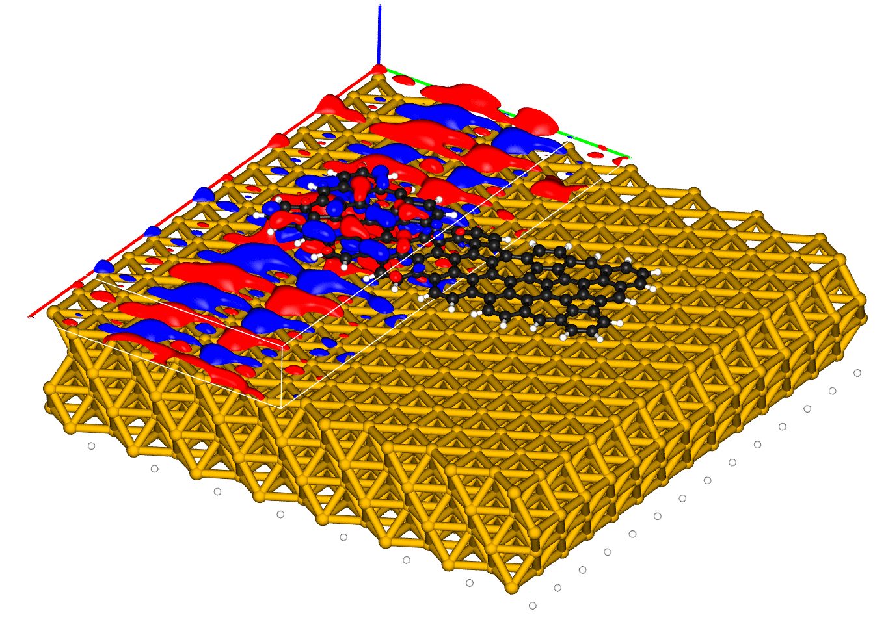

[](https://zenodo.org/badge/latestdoi/133041124)

## CP2K Scanning Probe Microscopy tools

Library and scripts to perform scanning probe microscopy simulations based on a [CP2K](https://www.cp2k.org/) calculation.

Features include:
* Processing the various output files of [CP2K](https://www.cp2k.org/), including the `.wfn` file
* Scanning Tunnelling Microscopy and Spectroscopy (STM/STS) analysis
* Fourier-Transformed STS analysis for finite cutouts of periodic systems
* Orbital hybridization analysis for adsorbed systems
* High-resolution STM (HRSTM) simulations

Requirements:
* numerical and scientific python libraries `numpy`, `scipy`
* Atomistic simulation environment `ase`
* `mpi4py` provides MPI parallelization

When everything is set up correctly, the bash scripts in `examples/` folder can be executed without any further input and illustrate the usage of the various scripts. For example `example/benzene_stm/run_stm_sts_from_wfn.sh` evaluates the STM/STS signatures of isolated benzene at each orbital energy (`out/orb/`) as well as in an arbitrary energy range (`out/stm/`). The corresponding CP2K calculation is included in the repository.

**NB: In all cases, the underlying DFT calculation has to be performed with the diagonalization algorithm rather than orbital transformation (OT).**

### Evaluating molecular orbitals on an arbitrary grid

Most of the functionality of this library is built on top of the possibility to evaluate the Kohn-Sham orbitals encoded in the `.wfn` file on an arbitrarily defined grid. This is illustrated by the following script applied for a nanographene adsorbed on a Au(111) slab (total of 1252 atoms and 10512 electrons):

```python
from cp2k_spm_tools.cp2k_grid_orbitals import Cp2kGridOrbitals

### Create the gridding object and load the cp2k data ###
cgo = Cp2kGridOrbitals()
cgo.read_cp2k_input("./cp2k.inp")
cgo.read_xyz("./geom.xyz")
cgo.read_basis_functions("./BASIS_MOLOPT")
cgo.load_restart_wfn_file("./PROJ-RESTART.wfn", n_occ=2, n_virt=2) 

### Evaluate the orbitals in the specific region ###
cgo.calc_morbs_in_region(
    dr_guess = 0.15,                        # grid spacing
    x_eval_region = None,                   # take whole cell in x
    y_eval_region = [0.0, cgo.cell[1]/2],   # half cell in y
    z_eval_region = [36.0, 44.0],           # around the molecule in z
)

cgo.write_cube("./homo.cube", orbital_nr=0)
```

The evaluated HOMO orbital in the defined region:



